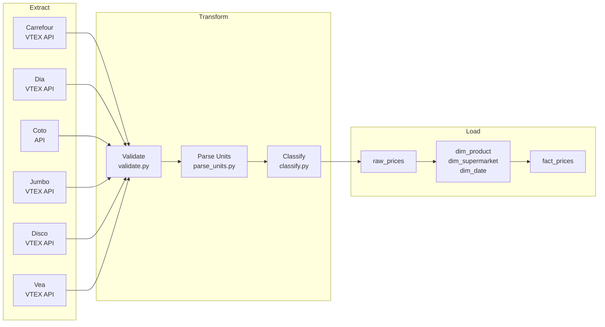
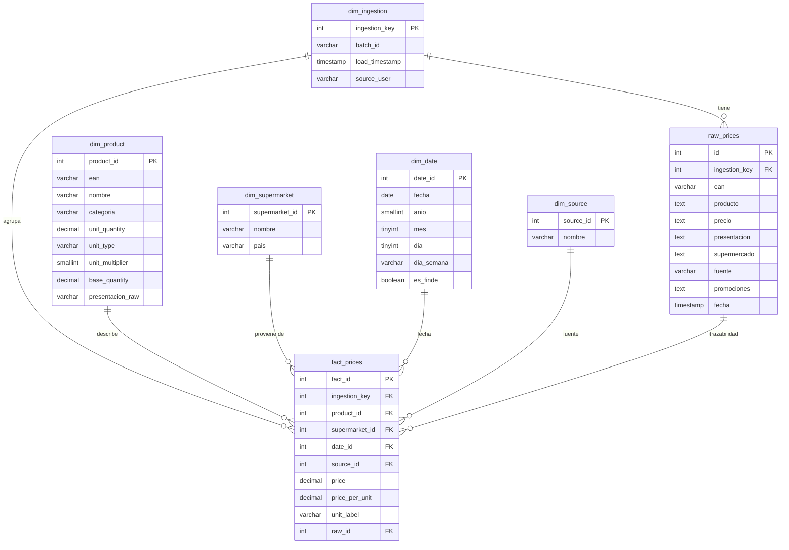
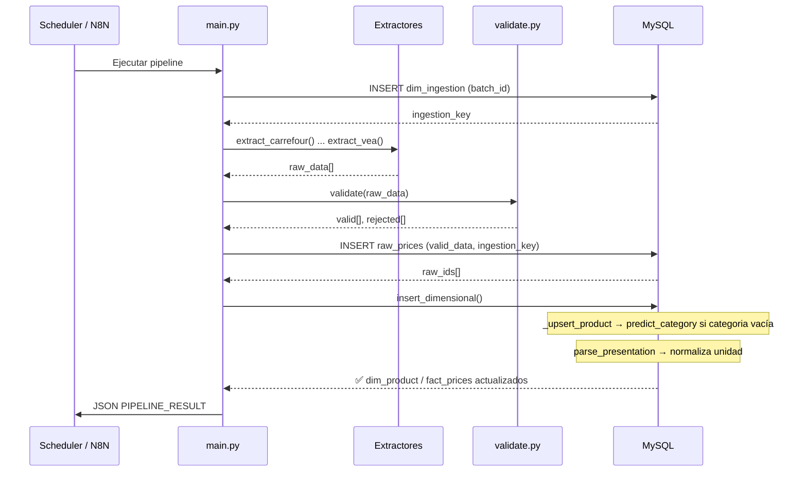
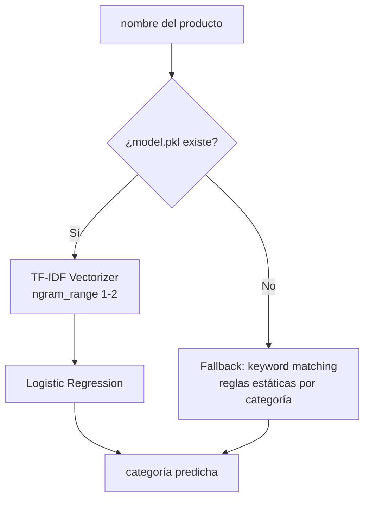

# Cazador de Precios 🛒

Pipeline ETL automatizado de precios de supermercados en Argentina.

Extrae precios de Carrefour, Dia, Coto, Jumbo, Disco y Vea — los normaliza, clasifica y almacena en un data warehouse relacional para análisis comparativo.

---

## El Problema

Comparar precios entre supermercados en Argentina es difícil. Los sitios no tienen APIs públicas documentadas, los formatos de presentación son inconsistentes ("500 g", "6 x 300 ml", "1.5 L") y las categorías que publica cada supermercado no son homogéneas entre sí.

El costo no es solo tiempo — es invisibilidad sobre dónde conviene comprar qué producto.

**Cazador de Precios** resuelve eso con un pipeline automatizado que:
- Extrae datos de 6 supermercados vía API
- Normaliza precios a una unidad base comparable (por 100g / 100ml / por unidad)
- Clasifica productos automáticamente con ML cuando la tienda no envía categoría
- Persiste todo en un modelo dimensional (star schema) listo para BI

---

## Cómo Funciona

El pipeline sigue cuatro etapas secuenciales:



### Estrategia de extracción

Cada supermercado tiene su propio extractor. La extracción es 100% directa por API.

| Supermercado | Fuente primaria |
|---|---|
| Carrefour | VTEX API (`/catalog_system/pub/products/search`) |
| Dia | VTEX API |
| Jumbo | VTEX API (`vtex_base`) |
| Disco | VTEX API (`vtex_base`) |
| Vea | VTEX API (`vtex_base`) |
| Coto | API propia |

Los cinco supermercados VTEX usan una base común (`vtex_base.py`) que maneja paginación y parseo de ítems.

---

## Arquitectura

### Modelo de datos (Star Schema)



### Flujo de ejecución del pipeline



---

## Clasificación de Categorías (ML)

Los supermercados envían categorías inconsistentes o vacías. El clasificador resuelve eso automáticamente durante la carga.

### Cómo funciona

- **`transform/classify.py`**: expone `predict_category(nombre) → str`. Carga el modelo entrenado una sola vez (lazy load). Si no existe el `.pkl`, cae al fallback de reglas por keywords.
- **`load/load_db.py`**: en `_upsert_product`, si `categoria` está vacía o es `None`, llama a `predict_category(nombre)` antes de insertar.

### Arquitectura del clasificador



### Categorías objetivo

| Categoría | Ejemplos de keywords |
|---|---|
| Lácteos | leche, yogur, queso, manteca, serenísima |
| Básicos de Almacén | arroz, fideos, aceite, sal, harina, polenta |
| Bebidas con Alcohol | cerveza, vino, fernet, gin, whisky, sidra |
| Bebidas sin Alcohol | gaseosa, agua, jugo, coca, pepsi, sprite |
| Frutas y Verduras | papa, cebolla, tomate, manzana, banana |
| Carnicería y Pescadería | carne, pollo, hamburguesa, milanesa, merluza |
| Panadería y Galletitas | pan, galletitas, alfajor, lactal, chocolinas |
| Cuidado Personal | shampoo, desodorante, pañales, colgate, dove |
| Limpieza del Hogar | detergente, lavandina, desinfectante, skip |
| Congelados y Otros | helado, nuggets, papas congeladas |

### Entrenar el modelo manualmente

```bash
# Requiere que el contenedor de MySQL esté corriendo
uv run python train_model.py
```

Esto conecta a la base, hace bootstrap de labels con las reglas de keywords, entrena el pipeline `TF-IDF + LogisticRegression` y guarda el modelo en `model/category_model.pkl`. Se recomienda re-entrenar cuando haya un volumen significativo de nuevos productos.

---

## Normalización de Unidades

El módulo `transform/parse_units.py` parsea el texto crudo de presentación y lo convierte a una unidad base para comparación justa entre productos de distinto tamaño.

**Formatos soportados:**

| Texto original | `unit_quantity` | `unit_type` | `base_quantity` | `unit_label` |
|---|---|---|---|---|
| `500 g` | 500 | g | 500 | por 100g |
| `1.5 L` | 1.5 | l | 1500 | por 100ml |
| `6 x 300 ml` | 300 | ml | 1800 | por 100ml |
| `1 kg` | 1 | kg | 1000 | por 100g |
| `Un` | 1 | un | 1 | por unidad |

El campo `price_per_unit` en `fact_prices` permite comparar el precio real por 100g o 100ml independientemente del tamaño del envase.

## Inicio Rápido

El proyecto está diseñado con una separación clara de responsabilidades:
1. **Infraestructura (Docker):** Administra la base de datos MySQL y la UI de administración.
2. **Entorno de desarrollo local (uv):** Maneja el entorno virtual y la ejecución de los scripts de Python.
3. **Calidad del código (Ruff + pyproject.toml):** Valida el estilo y buenas prácticas localmente.

### 1. Configurar variables de entorno

```bash
cp .env.example .env
# Completar con credenciales de la base de datos
```

Variables requeridas en `.env`:
```
MYSQL_ROOT_PASSWORD=...
DB_HOST=localhost
DB_USER=root
DB_PASSWORD=...
DB_NAME=prices
```

### 2. Levantar la base de datos (Docker)

La base de datos MySQL debe estar corriendo para poder ejecutar el pipeline o el script de entrenamiento:

```bash
docker compose up mysql phpmyadmin -d
```

El schema se inicializa automáticamente desde `db/schema.sql` en el primer arranque. phpMyAdmin queda disponible en `http://localhost:8080`.

### 3. Sincronizar dependencias locales (uv)

Para ejecutar scripts localmente en tu máquina, inicializa el entorno virtual administrado por `uv`:

```bash
# Inicializar entorno virtual e instalar dependencias locales automáticamente
uv sync
```

### 4. Ejecutar el pipeline

**Modo manual (Local con uv - Recomendado para desarrollo):**
```bash
uv run python main.py
```

**Modo automatizado (Docker + cron scheduler):**
```bash
docker compose --profile cron up
```

### 5. Entrenar el clasificador ML (Manual con uv)

Una vez que tengas datos en tu base de datos local, puedes entrenar el modelo:
```bash
uv run python train_model.py
```

### 6. Backfill de EAN (Manual con uv)

Si hay productos en la base sin EAN que ya tienen un gemelo con EAN cargado después:
```bash
uv run python backfill_ean.py
```

---

## Calidad de Código & Linting

Usamos **Ruff** configurado en el archivo `pyproject.toml` para mantener el código limpio y estandarizado de acuerdo a buenas prácticas de la industria.

### Chequear linting:
```bash
uv run ruff check .
```

### Autoformatear código:
```bash
uv run ruff format .
```

---

## Scripts de Utilidad

| Script | Descripción |
|---|---|
| `train_model.py` | Entrena el clasificador ML desde los registros actuales de `dim_product` |
| `backfill_ean.py` | Propaga EAN a registros históricos que comparten nombre con un producto ya identificado |

---

## Stack Tecnológico

| Capa | Tecnología |
|---|---|
| Extracción | `requests` (API VTEX y API propia) |
| Transformación | Python puro + `re` para parseo de unidades |
| Clasificación | `scikit-learn` (TF-IDF + Logistic Regression) |
| Base de datos | MySQL 8 (Docker) |
| Calidad | Ruff + `pyproject.toml` |
| Gestión de Entorno | uv (Astral) |
| Orquestación | Docker Compose + N8N (scheduler externo) |
| UI de base | phpMyAdmin |

---

## Estructura del Proyecto

```
supermercado/
├── backend/
│   ├── extract/
│   │   ├── vtex_base.py        # Extractor genérico para supermercados VTEX
│   │   ├── carrefour.py        # Extractor Carrefour (API VTEX)
│   │   ├── dia.py              # Extractor Dia
│   │   ├── coto.py             # Extractor Coto
│   │   ├── jumbo.py            # Extractor Jumbo
│   │   ├── disco.py            # Extractor Disco
│   │   └── vea.py              # Extractor Vea
│   ├── transform/
│   │   ├── classify.py         # Clasificador ML de categorías
│   │   ├── parse_units.py      # Parser y normalizador de unidades
│   │   ├── validate.py         # Validación y deduplicación del lote
│   │   └── clean_data.py       # Limpieza auxiliar
│   ├── load/
│   │   └── load_db.py          # Upsert dimensional + inserción en fact_prices
│   ├── db/
│   │   └── schema.sql          # DDL del star schema
│   ├── model/
│   │   └── category_model.pkl  # Modelo ML entrenado (generado por train_model.py)
│   ├── tests/                  # Pruebas automatizadas del pipeline
│   ├── main.py                 # Punto de entrada del pipeline
│   ├── train_model.py          # Script de entrenamiento del clasificador
│   ├── backfill_ean.py         # Utilidad de backfill de EAN
│   ├── Dockerfile
│   ├── pyproject.toml          # Configuración de Ruff
│   └── requirements.txt
├── frontend/
│   ├── index.html              # Interfaz de usuario del dashboard
│   ├── style.css               # Estilos de la UI (Glassmorphic design)
│   └── app.js                  # Lógica interactiva y simulador
├── docker-compose.yml
└── README.md
```


---

## Proveniencia de los Datos

Los datos se obtienen directamente desde las APIs públicas de cada supermercado.

| Fuente | Método | URL base |
|---|---|---|
| Carrefour | VTEX API | `carrefour.com.ar` |
| Dia | VTEX API | `diaonline.supermercadosdia.com.ar` |
| Jumbo | VTEX API | `jumbo.com.ar` |
| Disco | VTEX API | `disco.com.ar` |
| Vea | VTEX API | `vea.com.ar` |
| Coto | API propia | `cotodigital3.com.ar` |

Los datos extraídos son de carácter público (precios y nombres de productos visibles a cualquier visitante del sitio). No se almacena información personal de ningún tipo. El pipeline solo registra nombre del producto, precio, presentación, supermercado y fecha de extracción.
