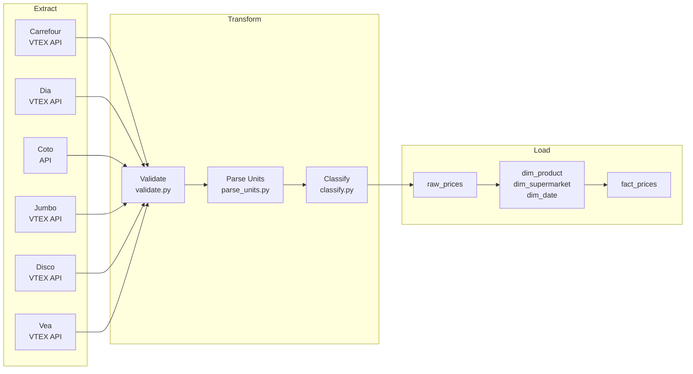
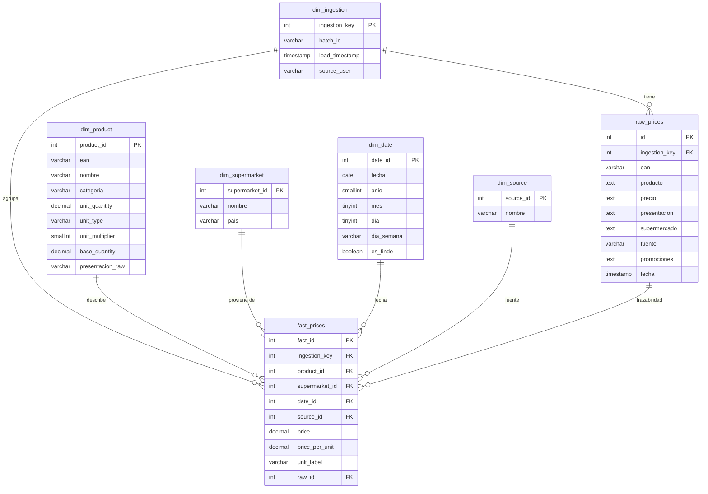
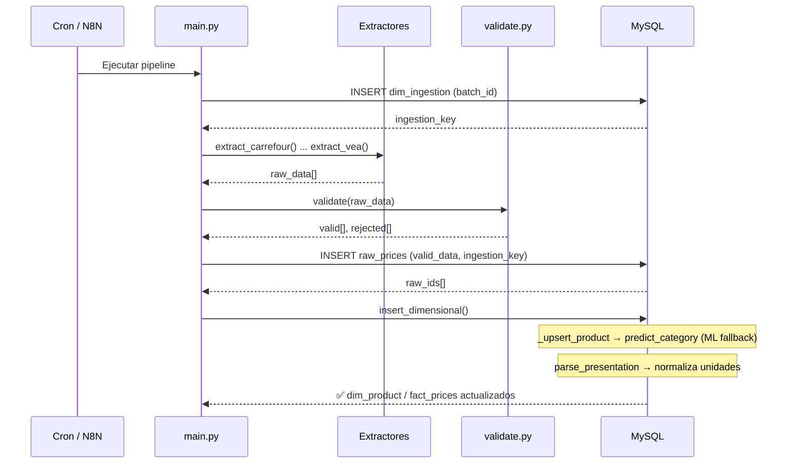

# Apartado Técnico - CompraIQ 🛠️

Este documento reúne la especificación técnica, arquitectura, estructura del proyecto, guías de inicio rápido y detalles de los algoritmos de backend y base de datos de CompraIQ.

---

## Inicio Rápido (El flujo más cómodo)

Para ejecutar el proyecto de forma ágil, levantamos la infraestructura del servidor y base de datos con **Docker**, corremos la interfaz visual de la webapp de forma **local**, y elegimos cómo ejecutar el cargador de datos.

### 1. Iniciar la Base de Datos y la API Backend (Docker)
Este comando levanta MySQL, phpMyAdmin (puerto `8080`) y la API intermedia de promociones en Python (puerto `5000`):

```bash
# 1. Copiar y configurar las variables de entorno
cp .env.example .env

# 2. Levantar los servicios de base
docker compose up mysql api phpmyadmin -d
```

### 2. Iniciar el Frontend (Local con Node/npm)
La webapp de React se comunica con la API iniciada en el paso anterior.
```bash
cd frontend
npm install
npm run dev
```
*La interfaz queda disponible en tu navegador en `http://localhost:5173`.*

### 3. Cargar Precios y Promociones (ETL)
Para poblar la base de datos con precios reales y promociones vigentes de los supermercados, podés ejecutar el pipeline de dos formas:

- **Opción A (Recomendada - Con Docker sin instalar Python):**
  ```bash
  docker compose run --rm app
  ```

- **Opción B (Localmente - Usando uv):**
  ```bash
  # Sincronizar el entorno de dependencias locales
  uv sync
  # Correr el cargador manual
  uv run python main.py
  ```

---

## Estructura de Archivos del Proyecto

```
supermercado/
├── backend/
│   ├── extract/          # Scripts ETL de extracción para Carrefour, Dia, Coto, Jumbo, Disco y Vea
│   ├── transform/        # Normalizador de unidades y clasificador de categorías por Machine Learning
│   ├── load/             # Módulo de carga relacional dimensional
│   ├── db/               # Esquema DDL para MySQL
│   ├── model/            # Clasificador ML entrenado (.pkl)
│   └── main.py           # Orquestador del pipeline ETL
├── frontend/
│   ├── index.html        # HTML inicial
│   ├── vite.config.js    # Configuración de Vite
│   ├── package.json      # Configuración y scripts npm
│   └── src/
│       ├── main.jsx      # Entrada React
│       ├── App.jsx       # Componente principal de simulador, changuito y beneficios
│       ├── index.css     # Estilos de marca CompraIQ (Premium Warm Aesthetic)
│       └── App.css       # Estilos complementarios
├── docker-compose.yml    # Infraestructura MySQL, phpMyAdmin y Cron
└── README.md
```

---

## Cómo Funciona el Backend (ETL)

El pipeline backend sigue cuatro etapas secuenciales para alimentar la base de datos de precios:



### Estrategia de Extracción

Cada supermercado tiene su propio extractor que consume directamente APIs públicas.

| Supermercado | Fuente primaria | Método / Endpoint |
|---|---|---|
| Carrefour | VTEX API | `/catalog_system/pub/products/search` |
| Dia | VTEX API | `/catalog_system/pub/products/search` |
| Jumbo | VTEX API | Base común VTEX |
| Disco | VTEX API | Base común VTEX |
| Vea | VTEX API | Base común VTEX |
| Coto | API propia | Parser de catálogo directo |

Los extractores VTEX usan la clase base común `vtex_base.py` para manejar la paginación recursiva, token buckets de reintento y parseo de ítems estructurados.

---

## Arquitectura del Modelo de Datos (Star Schema)

La base de datos MySQL utiliza un modelo en estrella (Star Schema) para facilitar consultas analíticas rápidas de comparación de canastas históricas.



### Flujo de ejecución del pipeline



---

## Clasificación de Categorías (Machine Learning)

Dado que las APIs de los supermercados catalogan de forma inconsistente, implementamos un modelo de clasificación automática:

- **Algoritmo:** Regresión Logística multiclase combinada con vectorización TF-IDF (`ngram_range` de 1 a 2).
- **Fallback:** En caso de que no exista el archivo del modelo `category_model.pkl`, el pipeline utiliza una búsqueda estática por palabras clave estructuradas.
- **Entrenamiento:** Puede ejecutarse mediante `uv run python train_model.py`, que lee los productos ya cargados en la base y reconstruye el clasificador.

---

## Normalización de Unidades

El módulo `transform/parse_units.py` analiza las descripciones textuales de las presentaciones (ej: `"6 u x 330 cc"`, `"1.5 kg"`, `"500 grs"`) y las desglosa en:
- `unit_quantity`: Cantidad unitaria líquida/sólida.
- `unit_type`: Tipo de unidad (`g`, `ml`, `un`, etc).
- `base_quantity`: Peso/volumen total neto en unidad base estandarizada.
- `price_per_unit`: Precio real prorrateado (normalizado por cada 100g, 100ml o por unidad). Esto asegura comparaciones de precio reales independientemente del packaging.

---

## Proveniencia de los Datos

Los datos son estrictamente públicos y extraídos sin credenciales de usuario de los sitios web oficiales en Argentina:
- Carrefour: `carrefour.com.ar`
- Dia: `diaonline.supermercadosdia.com.ar`
- Jumbo: `jumbo.com.ar`
- Disco: `disco.com.ar`
- Vea: `vea.com.ar`
- Coto: `cotodigital3.com.ar`
